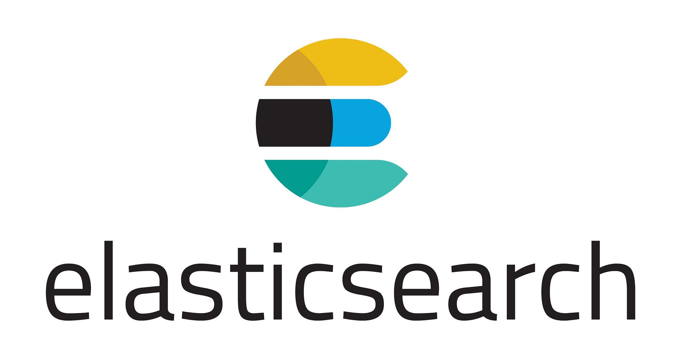
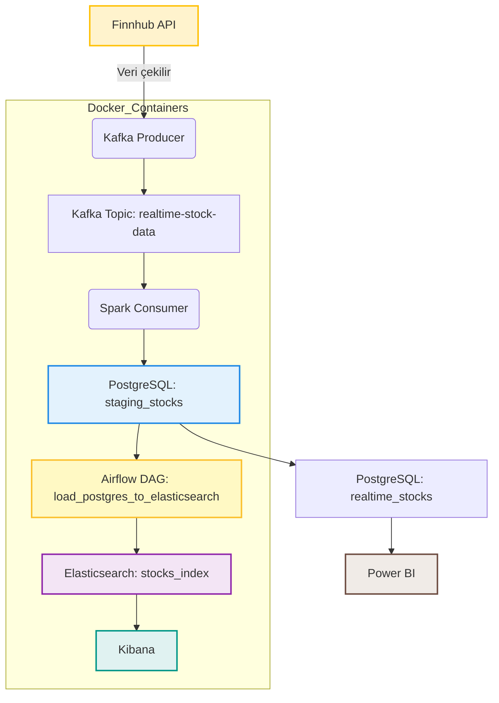
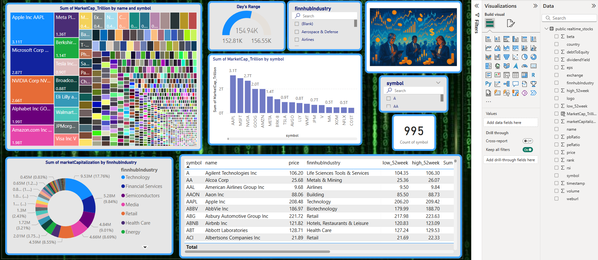

# 📈 MarketStream_AirSpark

Gerçek zamanlı ABD hisse senedi verilerini toplayan, zenginleştiren ve analiz eden bir veri mühendisliği projesidir. Veriler Finnhub API üzerinden çekilir, Apache Kafka ile iletilir, Apache Spark ile işlenir ve zenginleştirilir. Veriler PostgreSQL'e yazılır, ardından Elasticsearch'e aktarılır ve Kibana ya da Power BI ile görsellenebilir.

## 🚀 Kullanılan Teknolojiler

| Teknoloji/Araç     | Açıklama                                | Logo                                                                                                 |
|--------------------|-----------------------------------------|------------------------------------------------------------------------------------------------------|
| **Finnhub API**    | Anlık ve geçmiş finansal veriler        |                                |
| **Apache Kafka**   | Gerçek zamanlı veri akışı               |                 |
| **Apache Spark**   | Streaming veri işleme ve zenginleştirme |                  |
| **PostgreSQL**     | Yapılandırılmış veri deposu             |                         |
| **Elasticsearch**  | Veri arama ve indeksleme                |         |
| **Kibana**         | Elasticsearch verilerini görselleştirme |                           |
| **Apache Airflow** | CI/CD Orkestrasyon                      |          |
| **Docker Compose** | Servisleri container ortamında çalıştırma|          |
| **Python**         | Script ve veri işleme dili              |                             |
| **DBeaver**        | Database IDE                            |                             |


- 📨 **Kafka** — Gerçek zamanlı veri kuyruğu
- ⚡ **Apache Spark** — Streaming veriyi işleme ve zenginleştirme
- 🧪 **Finnhub API** — Anlık ve geçmiş finansal veriler
- 🐘 **PostgreSQL** — Yapılandırılmış veri deposu
- 🧠 **Elasticsearch** — Arama ve analiz için NoSQL motoru
- 📊 **Kibana / Power BI** — Görselleştirme için
- 🛫 Apache Airflow — Veri akışı orkestrasyonu ve otomatikleştirme
- 🐳 **Docker Compose** — Tüm servisleri ayağa kaldırmak için
- 🐍 **Python** — Kafka Producer, Spark scriptleri ve API bağlantıları için




---

## 📁 Proje Dizini

```
MarketStream_AirSpark/
├── airflow/
│   ├── dags/
│   │   ├── finnhub_realtime_producer.py          # API verilerini Kafka'ya yollar
│   │   ├── spark_consumer.py                     # Spark ile Kafka'dan veri çeker
│   │   └── load_postgres_to_elasticsearch.py     # PostgreSQL → Elasticsearch DAG
│   ├── scripts/                                  # Spark & Kafka script dizini
│   ├── Dockerfile                                # Airflow webserver/scheduler
│   └── Dockerfile.init                           # Airflow init container
├── data/
│   └── stock_metadata_1000.parquet               # İlk 1000 hissenin temel bilgileri
├── jars/                                         # Spark ile PostgreSQL ve Elasticsearch için JAR dosyaları
├── tools/
│   └── fetch_stock_metadata.py                   # Hisse metadata'larını indirip kaydeder
├── requirements_spark.txt                        # Spark container için Python modülleri
├── docker-compose.yml                            # Tüm servisler buradan başlatılır
└── .env                                          # API anahtarı burada
```


---

## ⚙️ Kurulum

### 1. Ortam Değişkenleri

Proje kök dizininde bir `.env` dosyası oluştur:

```env
FINNHUB_API_KEY=senin_finnhub_api_keyin
```

---

### 2. Docker Servislerini Başlat

```bash
docker compose up -d --build
```

---

### 3. İlk 1000 Hisseyi Belirle (İsteğe bağlı)

```bash
python tools/fetch_stock_metadata.py
```

Bu script çalıştığında `data/stock_metadata_1000.parquet` dosyasını üretir.

---

## 🚀 Akış Özeti

1. `finnhub_realtime_producer.py` → API'den veri çek, Kafka'ya gönder (`localhost:9094`)
2. `spark_consumer.py` → Kafka'dan oku, metadata ile birleştir, PostgreSQL'e yaz
3. `load_postgres_to_elasticsearch.py` → PostgreSQL'den veriyi çek, Elasticsearch'e aktar

---

## 🔁 Veri Akışı

### 1. Kafka Producer'ı Başlat

```bash
(base) [train@trainvm scripts]$ cd /home/train/dataops/MarketStream_AirSpark/
(base) [train@trainvm MarketStream_AirSpark]$ source venv/bin/activate
(venv) (base) [train@trainvm MarketStream_AirSpark]$ cd airflow/scripts/
(venv) (base) [train@trainvm scripts]$ python finnhub_realtime_producer.py
```

⏺ Gönderilen veri şunları içerir:
- Fiyat, Hacim, 52 haftalık yüksek/düşük
- Şirket adı, sektör, ülke, borsa
- Piyasa değeri, F/K, P/B, temettü, beta, EPS
- RSI gibi teknik göstergeler

---

### 2. Spark Consumer'ı Çalıştır

```bash
docker exec spark_client spark-submit \
  --jars /opt/bitnami/spark/user-jars/spark-sql-kafka-0-10_2.12-3.5.5.jar,\
/opt/bitnami/spark/user-jars/kafka-clients-3.5.1.jar,\
/opt/bitnami/spark/user-jars/spark-token-provider-kafka-0-10_2.12-3.5.5.jar,\
/opt/bitnami/spark/user-jars/commons-pool2-2.11.1.jar,\
/opt/bitnami/spark/user-jars/postgresql-42.7.1.jar,\
/opt/bitnami/spark/user-jars/elasticsearch-spark-30_2.12-8.11.1.jar \
  /opt/spark/scripts/spark_consumer.py
```

💡 `logo` (firma logosu) sütunu konsolda görüntülenmez ama veri olarak tutulur.

---

### 3. PostgreSQL → Elasticsearch Aktarımı

Airflow üzerinden DAG tetiklenir:

- DAG: `load_postgres_to_elasticsearch.py`
- Kaynak tablo: `realtime_stocks`
- Hedef index: `stocks_index`
- Sadece **en son 1000 unique hisse** Elasticsearch'e aktarılır

---

## Kafka'da Gerçek Zamanlı Mesajları Görmek İçin

```bash
docker exec -it kafka kafka-console-consumer.sh \
  --bootstrap-server localhost:9092 \
  --topic realtime-stock-data \
  --from-beginning
```

---

## ✅ Örnek Kafka Verisi

```json
{
  "symbol": "AAPL",
  "timestamp": 1744926599160,
  "price": 196.98,
  "high_52week": 198.8335,
  "low_52week": 194.42,
  "volume": null,
  "name": "Apple Inc",
  "country": "US",
  "exchange": "NASDAQ NMS - GLOBAL MARKET",
  "finnhubIndustry": "Technology",
  "marketCapitalization": 2918338.16,
  "weburl": "https://www.apple.com/",
  "peRatio": 30.21,
  "pbRatio": 61.84,
  "dividendYield": 0.51,
  "beta": 1.29,
  "eps": 6.29,
  "debtToEquity": null,
  "rsi": null
}
```

---

## 📌 Notlar

- Kafka Topic: `realtime-stock-data`
- PostgreSQL Tablo: `realtime_stocks`
- Elasticsearch Index: `stocks_index`
- Spark çıktısı terminale akar; PostgreSQL ve Elasticsearch yazımları otomatik yapılır
- `stock_metadata_1000.parquet` yalnızca en çok işlem gören 1000 hisseyi içerir


## 📊 Finnhub API Veri Alanları ve Açıklamaları

| Alan              | Açıklama                                                     | Yorum (Yüksek / Düşük Ne Anlama Gelir?)                                                                 |
|-------------------|--------------------------------------------------------------|----------------------------------------------------------------------------------------------------------|
| `symbol`          | Hisse senedi sembolü (ör: AAPL)                              | -                                                                                                        |
| `timestamp`       | Verinin zaman damgası (Unix formatında)                      | -                                                                                                        |
| `price`           | Güncel hisse fiyatı                                          | Yüksekse: Güven ve talep yüksek olabilir. <br>Düşükse: Fırsat olabilir ama riskli de olabilir.           |
| `high_52week`     | Son 52 haftadaki en yüksek fiyat                             | Fiyat bu seviyeye yakınsa direnç testi yapılıyor olabilir.                                               |
| `low_52week`      | Son 52 haftadaki en düşük fiyat                              | Fiyat bu seviyeye yakınsa dip seviyede olabilir, ancak negatif sinyal de olabilir.                      |
| `volume`          | O gün işlem gören hisse sayısı (hacim)                       | Yüksekse: İlgi yoğun. <br>Düşükse: Talep az veya belirsizlik olabilir.                                  |
| `name`            | Şirketin adı                                                 | -                                                                                                        |
| `country`         | Şirketin kayıtlı olduğu ülke                                 | -                                                                                                        |
| `exchange`        | İşlem gördüğü borsa (ör: NYSE, NASDAQ)                       | -                                                                                                        |
| `finnhubIndustry` | Sektör bilgisi (ör: Technology, Healthcare)                  | -                                                                                                        |
| `marketCapitalization` | Piyasa değeri (milyar USD cinsinden)                   | Yüksekse: İstikrarlı, büyük şirket. <br>Düşükse: Daha riskli ama büyüme potansiyeli olabilir.            |
| `weburl`          | Şirketin resmi internet adresi                               | -                                                                                                        |
| `peRatio`         | Fiyat / Kazanç oranı (F/K)                                   | Yüksekse: Büyüme beklentisi var. <br>Düşükse: Ucuz olabilir ama kârlılık da düşük olabilir.              |
| `pbRatio`         | Fiyat / Defter değeri oranı                                  | 1’in altı: Ucuz olabilir. <br>Yüksekse: Aşırı değerlenmiş olabilir.                                      |
| `dividendYield`   | Temettü verimi (%)                                           | Yüksekse: Gelir odaklı yatırımcılar için olumlu. <br>Aşırı yüksekse sürdürülebilir olmayabilir.         |
| `beta`            | Hisse volatilitesi (piyasa ile kıyasla)                      | > 1: Daha oynak (riskli). <br> < 1: Daha istikrarlı.                                                     |
| `eps`             | Hisse başına kâr (Earnings Per Share)                        | Yüksekse: Şirket kârlı. <br>Düşükse/negatifse: Şirket zarar ediyor olabilir.                            |
| `debtToEquity`    | Borç / Özsermaye oranı                                       | Düşükse: Finansal yapı güçlü. <br>Yüksekse: Borç baskısı riski var.                                     |
| `rsi`             | Göreli Güç Endeksi (Relative Strength Index) (0–100)        | > 70: Aşırı alım (düşüş gelebilir). <br>< 30: Aşırı satım (alım fırsatı olabilir).                      |

 